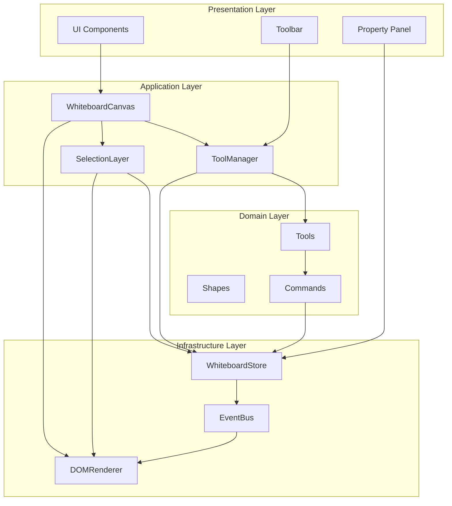
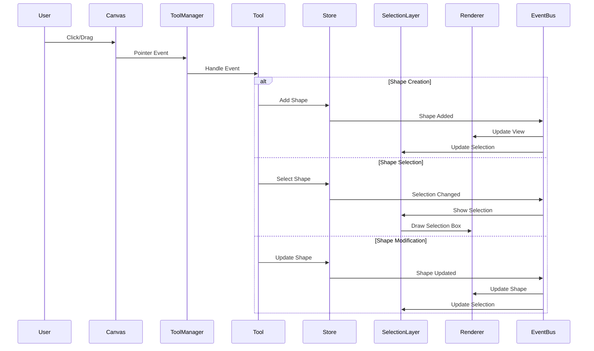
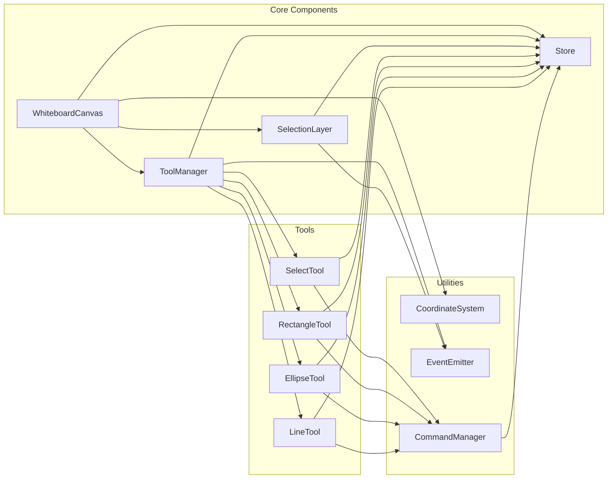
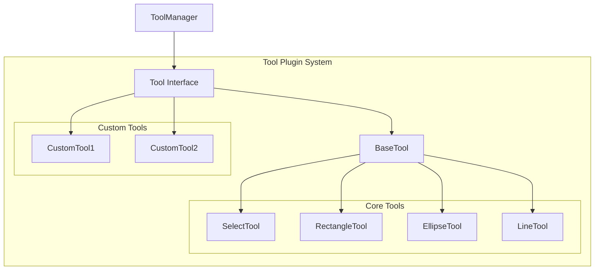
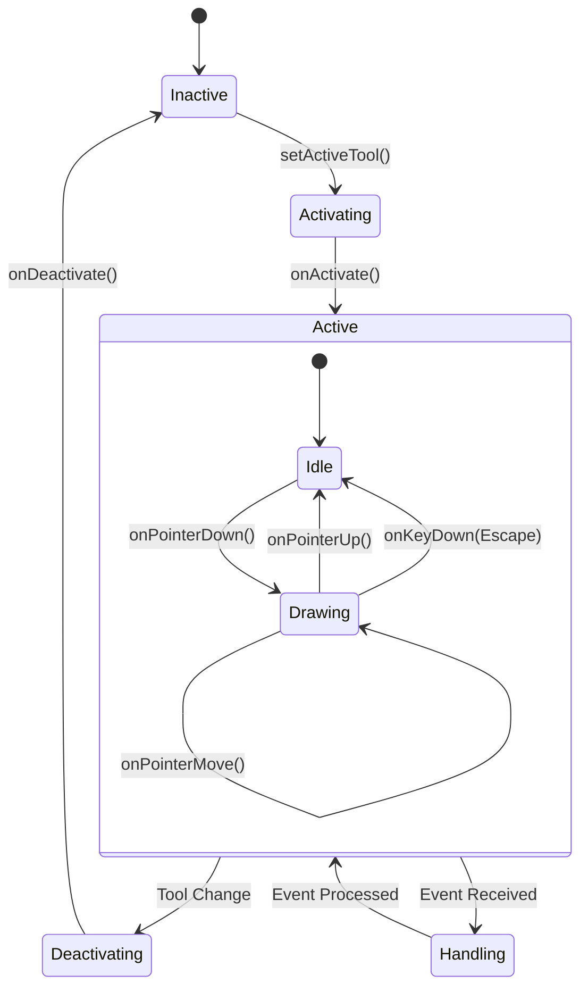
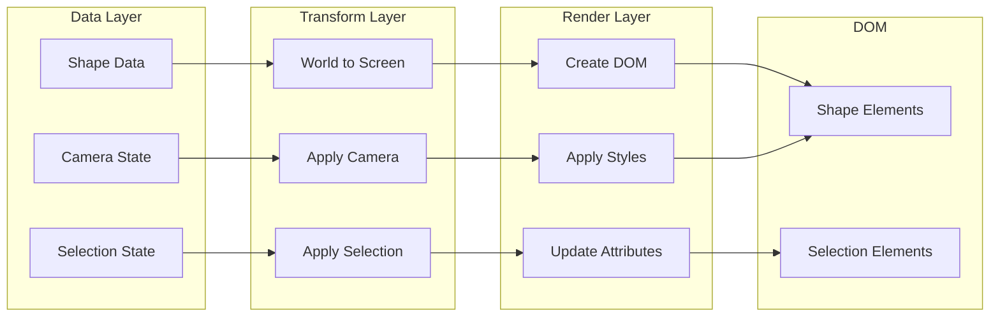
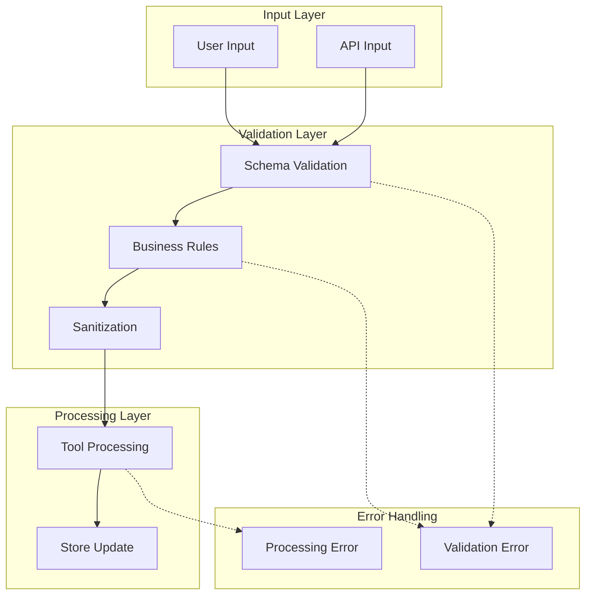
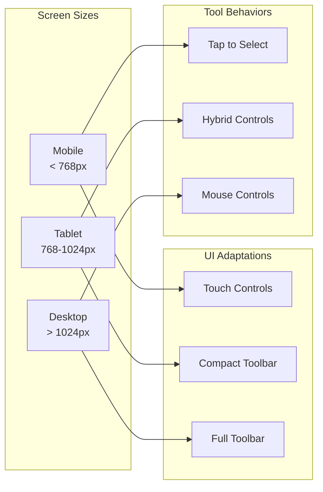

# コンポーネントアーキテクチャ図

## 🏗️ システム全体のアーキテクチャ

### レイヤード構造



## 🔄 データフローダイアグラム

### ユーザーインタラクションフロー



## 🧩 コンポーネント間の関係

### 依存関係マトリックス



## 📐 コンポーネント詳細設計

### WhiteboardCanvas

```
┌─────────────────────────────────────────────────────────┐
│                    WhiteboardCanvas                      │
├─────────────────────────────────────────────────────────┤
│ Properties:                                              │
│ - container: HTMLElement                                 │
│ - store: WhiteboardStore                                 │
│ - toolManager: ToolManager                               │
│ - selectionLayer: SelectionLayer                         │
│ - shapeLayer: HTMLElement                                │
├─────────────────────────────────────────────────────────┤
│ Methods:                                                 │
│ + initialize(): void                                     │
│ + setActiveTool(toolId: string): void                   │
│ + addShape(shape: Shape): void                          │
│ + removeShape(shapeId: string): void                    │
│ + render(): void                                         │
│ + destroy(): void                                        │
├─────────────────────────────────────────────────────────┤
│ Events:                                                  │
│ - canvas:ready                                           │
│ - canvas:destroyed                                       │
└─────────────────────────────────────────────────────────┘
```

### ToolManager

```
┌─────────────────────────────────────────────────────────┐
│                      ToolManager                         │
├─────────────────────────────────────────────────────────┤
│ Properties:                                              │
│ - tools: Map<string, Tool>                               │
│ - activeTool: Tool | null                                │
│ - context: ToolContext                                   │
│ - listeners: Map<string, EventListener>                 │
├─────────────────────────────────────────────────────────┤
│ Methods:                                                 │
│ + registerTool(tool: Tool): void                         │
│ + unregisterTool(toolId: string): void                  │
│ + setActiveTool(toolId: string): void                   │
│ + getActiveTool(): Tool | null                          │
│ + handlePointerEvent(event: PointerEvent): void         │
│ + handleKeyboardEvent(event: KeyboardEvent): void       │
├─────────────────────────────────────────────────────────┤
│ Events:                                                  │
│ - tool:activated                                         │
│ - tool:deactivated                                       │
└─────────────────────────────────────────────────────────┘
```

### SelectionLayer

```
┌─────────────────────────────────────────────────────────┐
│                    SelectionLayer                        │
├─────────────────────────────────────────────────────────┤
│ Properties:                                              │
│ - element: HTMLElement                                   │
│ - selectionBox: HTMLElement | null                       │
│ - resizeHandles: Map<string, HTMLElement>               │
│ - multiSelectBox: HTMLElement | null                     │
├─────────────────────────────────────────────────────────┤
│ Methods:                                                 │
│ + showSelection(shapeIds: string[]): void               │
│ + hideSelection(): void                                  │
│ + showResizeHandles(shape: Shape): void                 │
│ + hideResizeHandles(): void                             │
│ + updateSelection(): void                                │
│ + handleResize(handle: string, delta: Point): void      │
├─────────────────────────────────────────────────────────┤
│ Events:                                                  │
│ - selection:show                                         │
│ - selection:hide                                         │
│ - resize:start                                           │
│ - resize:end                                             │
└─────────────────────────────────────────────────────────┘
```

## 🔌 プラグインアーキテクチャ

### Tool Plugin System



### Tool Lifecycle



## 🎨 レンダリングパイプライン

### Shape Rendering Flow



## 📊 状態管理フロー

### Store State Updates

```mermaid
graph TB
    subgraph "User Actions"
        A1[Create Shape]
        A2[Select Shape]
        A3[Move Shape]
        A4[Delete Shape]
    end
    
    subgraph "Store Actions"
        SA1[addShape]
        SA2[selectShape]
        SA3[updateShape]
        SA4[removeShape]
    end
    
    subgraph "State Updates"
        SU1[shapes[]]
        SU2[selectedShapeIds[]]
        SU3[tool{}]
        SU4[camera{}]
    end
    
    subgraph "Subscriptions"
        SUB1[Canvas Render]
        SUB2[Selection Update]
        SUB3[Tool Update]
    end
    
    A1 --> SA1
    A2 --> SA2
    A3 --> SA3
    A4 --> SA4
    
    SA1 --> SU1
    SA2 --> SU2
    SA3 --> SU1
    SA4 --> SU1
    SA4 --> SU2
    
    SU1 --> SUB1
    SU2 --> SUB2
    SU3 --> SUB3
```

## 🔒 セキュリティと検証

### Input Validation Flow



## 🚀 パフォーマンス最適化

### Rendering Optimization Strategy

```
┌─────────────────────────────────────────────────────────┐
│                 Performance Pipeline                     │
├─────────────────────────────────────────────────────────┤
│  1. Viewport Culling                                    │
│     - Only render visible shapes                        │
│     - Calculate bounding boxes                          │
│                                                         │
│  2. Batch Updates                                       │
│     - Group DOM operations                              │
│     - Use requestAnimationFrame                         │
│                                                         │
│  3. Layer Caching                                       │
│     - Cache static elements                             │
│     - Update only changed elements                      │
│                                                         │
│  4. Event Debouncing                                    │
│     - Throttle pointer events                           │
│     - Batch state updates                               │
└─────────────────────────────────────────────────────────┘
```

## 📱 レスポンシブデザイン

### Breakpoint Handling



---

これらの図表は、システムの構造と動作を視覚的に理解するのに役立ちます。各コンポーネントの責務と相互作用が明確になり、新しい機能の追加や既存機能の拡張時の影響範囲を把握しやすくなります。