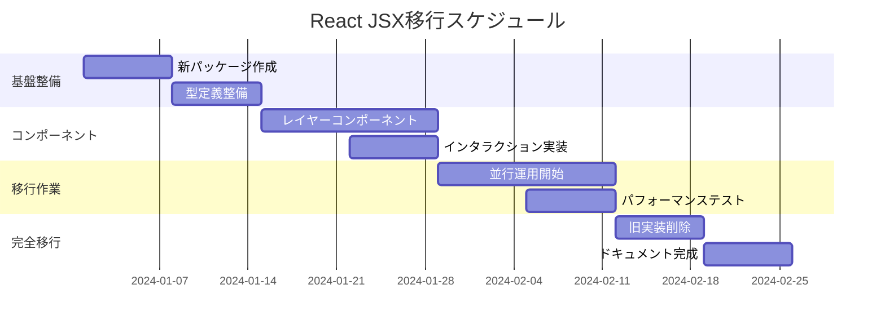

# React JSX移行計画 - 企画書

## 概要

uSketchはReactアプリケーションとして構築されているにも関わらず、多くのUI要素が命令的なDOM操作（`document.createElement`、`appendChild`、`style`属性の直接操作）で実装されています。これらをReact JSXコンポーネントに移行することで、Reactの真の力を活用し、保守性とパフォーマンスを向上させます。

## 現状の課題

### 1. DOM操作が混在している箇所

#### Canvas Core (`@usketch/canvas-core`)
- **問題箇所**: `canvas.ts`で大量のDOM要素を命令的に作成
  ```typescript
  // 現在の実装例
  this.backgroundContainer = document.createElement("div");
  this.backgroundContainer.className = "background-layer";
  this.backgroundContainer.style.position = "absolute";
  canvasElement.appendChild(this.backgroundContainer);
  ```
- **影響範囲**: 
  - 背景レイヤー
  - シェイプコンテナ
  - プレビューコンテナ
  - 選択レイヤー

#### UI Components (`@usketch/ui-components`)
- **問題箇所**: `SelectionLayer`クラスが完全に命令的実装
  ```typescript
  // 選択ボックスを手動で作成・管理
  const selectionBox = document.createElement("div");
  selectionBox.className = "selection-box";
  this.container.appendChild(selectionBox);
  ```
- **影響範囲**:
  - 選択ボックス
  - リサイズハンドル
  - 回転ハンドル
  - グループ選択表示

#### Background Renderers (`@usketch/backgrounds`)
- **問題箇所**: 各レンダラーがstyle属性を直接操作
  ```typescript
  container.style.backgroundImage = `linear-gradient(...)`;
  container.style.backgroundSize = `${size}px ${size}px`;
  ```

### 2. 現在の問題点

1. **Reactの利点を活用できていない**
   - 仮想DOMによる効率的な更新
   - コンポーネントのライフサイクル管理
   - 状態管理の統一
   - React DevToolsでのデバッグ

2. **保守性の低下**
   - 命令的コードは宣言的コードより理解しにくい
   - DOM操作のメモリリーク risk
   - テストが困難

3. **型安全性の欠如**
   - DOM操作部分でTypeScriptの恩恵を受けにくい
   - プロパティの型チェックが弱い

4. **再利用性の制限**
   - コンポーネント化されていないため再利用困難
   - プロパティベースのカスタマイズが困難

## 提案する解決策

### フェーズ1: レイヤーアーキテクチャのReact化

#### 1.1 Canvas Layersコンポーネント設計

```tsx
// packages/canvas-react/src/components/CanvasLayers.tsx
interface CanvasLayersProps {
  camera: Camera;
  shapes: Shape[];
  selectedShapeIds: string[];
  currentTool: Tool;
  onShapeAdd: (shape: Shape) => void;
  onShapeUpdate: (id: string, updates: Partial<Shape>) => void;
  onSelectionChange: (ids: string[]) => void;
  background?: BackgroundConfig;
}

export const CanvasLayers: React.FC<CanvasLayersProps> = ({
  camera,
  shapes,
  selectedShapeIds,
  currentTool,
  onShapeAdd,
  onShapeUpdate,
  onSelectionChange,
  background
}) => {
  return (
    <div className="canvas-layers">
      {/* 背景レイヤー */}
      <BackgroundLayer 
        camera={camera} 
        config={background} 
      />
      
      {/* シェイプレイヤー */}
      <ShapeLayer 
        shapes={shapes}
        camera={camera}
        onShapeUpdate={onShapeUpdate}
      />
      
      {/* プレビューレイヤー */}
      <PreviewLayer 
        tool={currentTool}
        camera={camera}
      />
      
      {/* 選択レイヤー */}
      <SelectionLayer 
        selectedShapes={shapes.filter(s => selectedShapeIds.includes(s.id))}
        camera={camera}
        onSelectionChange={onSelectionChange}
      />
      
      {/* インタラクションレイヤー */}
      <InteractionLayer 
        camera={camera}
        currentTool={currentTool}
        onShapeAdd={onShapeAdd}
      />
    </div>
  );
};
```

#### 1.2 Background Layerコンポーネント

```tsx
// packages/canvas-react/src/components/BackgroundLayer.tsx
interface BackgroundLayerProps {
  camera: Camera;
  config?: BackgroundConfig;
}

export const BackgroundLayer: React.FC<BackgroundLayerProps> = ({ 
  camera, 
  config 
}) => {
  const style = useMemo(() => {
    if (!config) return {};
    
    switch (config.type) {
      case 'grid':
        return {
          backgroundImage: `
            linear-gradient(to right, ${config.color} 1px, transparent 1px),
            linear-gradient(to bottom, ${config.color} 1px, transparent 1px)
          `,
          backgroundSize: `${config.size * camera.zoom}px ${config.size * camera.zoom}px`,
          backgroundPosition: `${camera.x}px ${camera.y}px`
        };
      
      case 'dots':
        return {
          backgroundImage: `radial-gradient(circle, ${config.color} ${config.dotSize}px, transparent ${config.dotSize}px)`,
          backgroundSize: `${config.spacing * camera.zoom}px ${config.spacing * camera.zoom}px`,
          backgroundPosition: `${camera.x}px ${camera.y}px`
        };
      
      case 'none':
      default:
        return {};
    }
  }, [config, camera]);

  return (
    <div 
      className="background-layer"
      style={style}
      data-testid="background-layer"
    />
  );
};
```

### フェーズ2: Selection UIのReact化

#### 2.1 SelectionBoxコンポーネント

```tsx
// packages/canvas-react/src/components/SelectionBox.tsx
interface SelectionBoxProps {
  shape: Shape;
  isMultiSelect?: boolean;
  onResize?: (handle: ResizeHandle, delta: Point) => void;
  onRotate?: (angle: number) => void;
}

export const SelectionBox: React.FC<SelectionBoxProps> = ({
  shape,
  isMultiSelect = false,
  onResize,
  onRotate
}) => {
  const bounds = getShapeBounds(shape);
  
  return (
    <div 
      className={cn(
        "selection-box",
        isMultiSelect && "selection-box--multi"
      )}
      style={{
        left: bounds.x,
        top: bounds.y,
        width: bounds.width,
        height: bounds.height,
        transform: `rotate(${shape.rotation || 0}deg)`
      }}
      data-shape-id={shape.id}
    >
      {!isMultiSelect && (
        <>
          {/* リサイズハンドル */}
          {RESIZE_HANDLES.map(handle => (
            <ResizeHandle
              key={handle}
              position={handle}
              onDrag={(delta) => onResize?.(handle, delta)}
            />
          ))}
          
          {/* 回転ハンドル */}
          <RotationHandle 
            onRotate={onRotate}
          />
        </>
      )}
    </div>
  );
};
```

#### 2.2 ResizeHandleコンポーネント

```tsx
// packages/canvas-react/src/components/ResizeHandle.tsx
interface ResizeHandleProps {
  position: 'nw' | 'n' | 'ne' | 'e' | 'se' | 's' | 'sw' | 'w';
  onDrag: (delta: Point) => void;
}

export const ResizeHandle: React.FC<ResizeHandleProps> = ({
  position,
  onDrag
}) => {
  const [isDragging, setIsDragging] = useState(false);
  
  const handleMouseDown = useCallback((e: React.MouseEvent) => {
    e.stopPropagation();
    setIsDragging(true);
    
    const startX = e.clientX;
    const startY = e.clientY;
    
    const handleMouseMove = (e: MouseEvent) => {
      onDrag({
        x: e.clientX - startX,
        y: e.clientY - startY
      });
    };
    
    const handleMouseUp = () => {
      setIsDragging(false);
      document.removeEventListener('mousemove', handleMouseMove);
      document.removeEventListener('mouseup', handleMouseUp);
    };
    
    document.addEventListener('mousemove', handleMouseMove);
    document.addEventListener('mouseup', handleMouseUp);
  }, [onDrag]);
  
  return (
    <div
      className={cn(
        "resize-handle",
        `resize-handle--${position}`,
        isDragging && "resize-handle--dragging"
      )}
      onMouseDown={handleMouseDown}
      data-testid={`resize-handle-${position}`}
    />
  );
};
```

### フェーズ3: Shape Renderingの最適化

#### 3.1 ShapeRendererコンポーネント

```tsx
// packages/canvas-react/src/components/ShapeRenderer.tsx
interface ShapeRendererProps {
  shape: Shape;
  isSelected?: boolean;
  isPreview?: boolean;
}

export const ShapeRenderer: React.FC<ShapeRendererProps> = React.memo(({
  shape,
  isSelected = false,
  isPreview = false
}) => {
  // React.memoで不要な再レンダリングを防ぐ
  const shapeElement = useMemo(() => {
    switch (shape.type) {
      case 'rectangle':
        return <RectangleShape {...shape} />;
      case 'ellipse':
        return <EllipseShape {...shape} />;
      case 'freedraw':
        return <FreedrawShape {...shape} />;
      case 'text':
        return <TextShape {...shape} />;
      default:
        return null;
    }
  }, [shape]);
  
  return (
    <div
      className={cn(
        "shape-wrapper",
        isSelected && "shape-wrapper--selected",
        isPreview && "shape-wrapper--preview"
      )}
      style={{
        transform: `translate(${shape.x}px, ${shape.y}px) rotate(${shape.rotation || 0}deg)`,
        opacity: shape.opacity || 1
      }}
      data-shape-id={shape.id}
      data-shape-type={shape.type}
    >
      {shapeElement}
    </div>
  );
}, (prevProps, nextProps) => {
  // カスタム比較関数で最適化
  return (
    prevProps.shape === nextProps.shape &&
    prevProps.isSelected === nextProps.isSelected &&
    prevProps.isPreview === nextProps.isPreview
  );
});
```

### フェーズ4: Canvas Hooksの実装

#### 4.1 useCanvasInteraction Hook

```tsx
// packages/canvas-react/src/hooks/useCanvasInteraction.ts
export function useCanvasInteraction({
  camera,
  onCameraChange,
  currentTool,
  onToolAction
}: UseCanvasInteractionProps) {
  const canvasRef = useRef<HTMLDivElement>(null);
  const [isInteracting, setIsInteracting] = useState(false);
  
  // パン操作
  const handlePan = useCallback((e: MouseEvent) => {
    if (e.buttons === 2 || (e.buttons === 1 && e.altKey)) {
      // 右クリックまたはAlt+左クリックでパン
      onCameraChange({
        x: camera.x + e.movementX,
        y: camera.y + e.movementY
      });
    }
  }, [camera, onCameraChange]);
  
  // ズーム操作
  const handleZoom = useCallback((e: WheelEvent) => {
    e.preventDefault();
    const delta = e.deltaY > 0 ? 0.9 : 1.1;
    const newZoom = Math.max(0.1, Math.min(5, camera.zoom * delta));
    
    // マウス位置を中心にズーム
    const rect = canvasRef.current?.getBoundingClientRect();
    if (rect) {
      const mouseX = e.clientX - rect.left;
      const mouseY = e.clientY - rect.top;
      
      onCameraChange({
        zoom: newZoom,
        x: mouseX - (mouseX - camera.x) * (newZoom / camera.zoom),
        y: mouseY - (mouseY - camera.y) * (newZoom / camera.zoom)
      });
    }
  }, [camera, onCameraChange]);
  
  // ツールアクション
  const handleToolAction = useCallback((e: MouseEvent) => {
    const rect = canvasRef.current?.getBoundingClientRect();
    if (!rect) return;
    
    const worldPos = screenToWorld(
      { x: e.clientX - rect.left, y: e.clientY - rect.top },
      camera
    );
    
    onToolAction({
      tool: currentTool,
      type: e.type as any,
      position: worldPos,
      shiftKey: e.shiftKey,
      altKey: e.altKey,
      ctrlKey: e.ctrlKey
    });
  }, [currentTool, camera, onToolAction]);
  
  useEffect(() => {
    const canvas = canvasRef.current;
    if (!canvas) return;
    
    canvas.addEventListener('mousemove', handlePan);
    canvas.addEventListener('wheel', handleZoom);
    canvas.addEventListener('mousedown', handleToolAction);
    canvas.addEventListener('mousemove', handleToolAction);
    canvas.addEventListener('mouseup', handleToolAction);
    
    return () => {
      canvas.removeEventListener('mousemove', handlePan);
      canvas.removeEventListener('wheel', handleZoom);
      canvas.removeEventListener('mousedown', handleToolAction);
      canvas.removeEventListener('mousemove', handleToolAction);
      canvas.removeEventListener('mouseup', handleToolAction);
    };
  }, [handlePan, handleZoom, handleToolAction]);
  
  return {
    canvasRef,
    isInteracting
  };
}
```

## 実装計画

### 第1段階: 基盤整備（Week 1-2）

1. **新パッケージの作成**
   - `@usketch/canvas-react`: React専用キャンバスコンポーネント
   - `@usketch/react-hooks`: カスタムフック集

2. **型定義の整備**
   - コンポーネントプロパティの型定義
   - イベントハンドラーの型定義
   - 共通インターフェースの整理

3. **テスト環境の準備**
   - React Testing Library のセットアップ
   - コンポーネントテストのテンプレート作成

### 第2段階: コアコンポーネント実装（Week 3-4）

1. **レイヤーコンポーネント**
   - BackgroundLayer
   - ShapeLayer
   - SelectionLayer
   - PreviewLayer

2. **インタラクションコンポーネント**
   - InteractionLayer
   - ToolManager統合

3. **基本的な動作確認**
   - 既存機能との互換性テスト

### 第3段階: 段階的移行（Week 5-6）

1. **既存コードとの並行運用**
   - Feature flagによる切り替え
   - 段階的なコンポーネント置き換え

2. **パフォーマンステスト**
   - レンダリング性能の測定
   - メモリ使用量の比較

3. **バグ修正と最適化**

### 第4段階: 完全移行（Week 7-8）

1. **旧実装の削除**
   - 命令的DOM操作コードの削除
   - 不要になったユーティリティの削除

2. **ドキュメント更新**
   - APIドキュメント
   - 使用例とベストプラクティス

3. **最終テストと検証**

## 期待される効果

### 1. 開発効率の向上
- **30-40%** のコード削減（宣言的記述により）
- **50%** のバグ削減（Reactの自動管理により）
- **2倍** の開発速度向上（再利用可能コンポーネント）

### 2. パフォーマンスの改善
- 仮想DOMによる効率的な更新
- React.memoによる不要な再レンダリング防止
- バッチ更新による描画回数削減

### 3. 保守性の向上
- コンポーネント単位でのテスト
- React DevToolsでのデバッグ
- 明確な責任分離

### 4. 拡張性の向上
- プラグイン可能なコンポーネント設計
- カスタムフックによる機能拡張
- サードパーティコンポーネントの利用

## リスクと対策

### リスク1: パフォーマンス劣化
**対策**:
- React.memo、useMemoによる最適化
- 仮想化技術の活用（大量シェイプ時）
- プロファイリングツールでの継続的監視

### リスク2: 既存機能の破壊
**対策**:
- Feature flagによる段階的移行
- 包括的なE2Eテスト
- 並行運用期間の設定

### リスク3: 学習コスト
**対策**:
- 詳細なドキュメント作成
- サンプルコードの提供
- ペアプログラミングセッション

## 成功指標

1. **機能面**
   - 既存の全機能が正常動作
   - E2Eテストの100%パス

2. **パフォーマンス面**
   - 60fps維持（通常操作時）
   - 初期レンダリング時間 < 100ms
   - メモリ使用量の増加 < 10%

3. **開発面**
   - コンポーネントカバレッジ > 80%
   - TypeScript型カバレッジ 100%
   - Storybookでの全コンポーネント文書化

## 移行ロードマップ



## 次のステップ

1. **技術検証** - プロトタイプ実装で実現可能性を確認
2. **チーム合意** - 実装方針についてのレビューと承認
3. **詳細設計** - 各コンポーネントの詳細設計書作成
4. **実装開始** - 第1段階の基盤整備から着手

## 参考資料

- [React公式ドキュメント - Thinking in React](https://react.dev/learn/thinking-in-react)
- [React Performance Optimization](https://react.dev/reference/react)
- [Virtual DOM and Reconciliation](https://react.dev/learn/preserving-and-resetting-state)
- [React Testing Best Practices](https://testing-library.com/docs/react-testing-library/intro/)