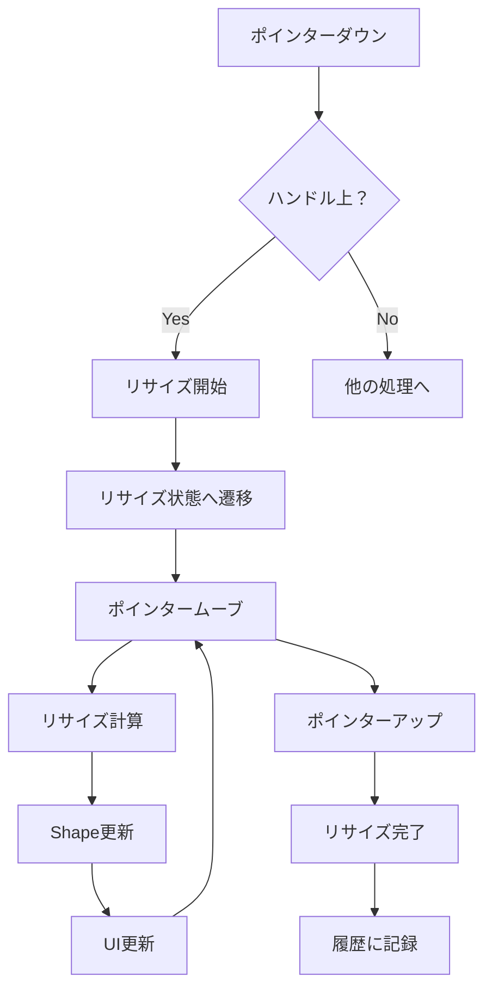

# Shape リサイズ機能実装計画書

## 📋 概要

このドキュメントは、uSketchプロジェクトにおけるShapeリサイズ機能の完全実装に向けた計画書です。現在、リサイズハンドルは表示されているものの、実際のリサイズ機能は未実装の状態にあります。

## 🎯 実装目標

Shapeを選択した際に表示される8方向のリサイズハンドルを使用して、直感的にShapeのサイズを変更できる機能を実装します。

### 必須要件
- [x] リサイズハンドルの表示（実装済み）
- [ ] リサイズハンドルのクリック検出
- [ ] ドラッグによるリサイズ処理
- [ ] リアルタイムプレビュー
- [ ] Undo/Redo対応

### 追加要件
- [ ] アスペクト比の維持（Shiftキー押下時）
- [ ] 最小/最大サイズ制約
- [ ] グリッドスナップ
- [ ] 複数選択時のグループリサイズ

## 📊 現状分析

### ✅ 実装済み部分

#### 1. UI層
- `packages/ui-components/src/selection-layer.ts`: 8方向のリサイズハンドル表示
- `packages/react-canvas/src/components/selection-layer.tsx`: React版のハンドル表示（4方向）
- ハンドルには`data-resize-handle`属性が設定済み

#### 2. 型定義
- `packages/shape-abstraction/src/types.ts`: ResizeHandle型定義
- `packages/shape-registry/src/types.ts`: getResizeHandlesメソッド定義
- `packages/shape-abstraction/src/base-shape.ts`: onResizeメソッドの基本実装

#### 3. Shapeプラグイン
- 各Shapeプラグイン（Rectangle, Ellipse等）で`getResizeHandles`実装済み

### ❌ 未実装部分

#### 1. イベントハンドリング
- リサイズハンドルのクリック・ドラッグイベントリスナー未実装
- ポインターイベントの振り分けロジック不足

#### 2. Select Tool統合
- `packages/tools/src/machines/select-tool.ts`: リサイズ状態管理未実装
- `getCropHandleAtPoint`関数が空実装
- リサイズ中の状態遷移未定義

#### 3. リサイズ計算ロジック
- 座標変換（スクリーン座標 ↔ ワールド座標）
- リサイズ制約（最小/最大サイズ、アスペクト比）
- 対角・エッジハンドルごとの計算ロジック

## 🏗️ 実装アーキテクチャ

### 1. 状態管理の拡張

```typescript
// packages/tools/src/machines/select-tool.ts

type SelectToolState = 
  | { type: 'idle' }
  | { type: 'selecting'; startPoint: Point }
  | { type: 'translating'; startPoint: Point; initialPositions: Map<string, Point> }
  | { type: 'resizing'; handle: ResizeHandle; startPoint: Point; initialBounds: Bounds };

type ResizeHandle = 
  | 'nw' | 'n' | 'ne' 
  | 'w'  |     | 'e'
  | 'sw' | 's' | 'se';
```

### 2. イベントフロー



### 3. コンポーネント連携

```typescript
// イベントの流れ
Canvas → useInteraction → SelectTool → Store → Shape → UI
```

## 📝 実装タスク

### Phase 1: 基本機能実装（必須）

#### Task 1.1: Select Toolの拡張
**ファイル**: `packages/tools/src/machines/select-tool.ts`
```typescript
// 実装内容
- リサイズ状態の追加
- getCropHandleAtPoint関数の実装
- handlePointerDown/Move/Upでのリサイズ処理追加
```

#### Task 1.2: ハンドル検出ロジック
**ファイル**: `packages/shared-utils/src/geometry.ts`
```typescript
export function getResizeHandleAtPoint(
  point: Point,
  bounds: Bounds,
  handles: ResizeHandle[],
  tolerance: number = 10
): ResizeHandle | null {
  // 各ハンドルの位置を計算
  // ポイントとの距離を測定
  // 最も近いハンドルを返す
}
```

#### Task 1.3: リサイズ計算エンジン
**新規ファイル**: `packages/shared-utils/src/resize-calculator.ts`
```typescript
export class ResizeCalculator {
  static calculateNewBounds(
    originalBounds: Bounds,
    handle: ResizeHandle,
    delta: Point,
    constraints?: ResizeConstraints
  ): Bounds {
    // ハンドルごとの計算ロジック
    // 制約の適用
    // 新しいBoundsを返す
  }
}
```

#### Task 1.4: Storeの更新
**ファイル**: `packages/store/src/whiteboard-store.ts`
```typescript
// 追加するアクション
resizeShape: (shapeId: string, newBounds: Bounds) => void
startResize: (shapeId: string) => void
endResize: () => void
```

#### Task 1.5: イベントリスナー統合
**ファイル**: `packages/react-canvas/src/hooks/use-interaction.ts`
```typescript
// リサイズハンドルのイベント処理を追加
const handlePointerDown = (e: PointerEvent) => {
  const handle = getResizeHandleFromTarget(e.target);
  if (handle) {
    tool.startResize(handle, point);
    return;
  }
  // 既存の処理...
};
```

### Phase 2: ユーザビリティ向上（推奨）

#### Task 2.1: アスペクト比維持
```typescript
// Shiftキー押下時の処理
if (e.shiftKey) {
  bounds = maintainAspectRatio(bounds, originalAspectRatio);
}
```

#### Task 2.2: 最小/最大サイズ制約
```typescript
interface ShapeConstraints {
  minWidth?: number;
  minHeight?: number;
  maxWidth?: number;
  maxHeight?: number;
}
```

#### Task 2.3: ビジュアルフィードバック
- リサイズ中のカーソル変更
- リサイズ中の寸法表示
- スムーズなアニメーション

### Phase 3: 高度な機能（オプション）

#### Task 3.1: グリッドスナップ
```typescript
if (gridEnabled) {
  bounds = snapToGrid(bounds, gridSize);
}
```

#### Task 3.2: 複数選択時のグループリサイズ
- 選択グループ全体の比率維持
- 個別Shapeの相対位置保持

#### Task 3.3: 回転との統合
- 回転したShapeのリサイズ対応
- 回転ハンドルとの切り替え

## 🧪 テスト計画

### 単体テスト
```typescript
// packages/shared-utils/src/__tests__/resize-calculator.test.ts
describe('ResizeCalculator', () => {
  test('各ハンドルでの正しいリサイズ計算');
  test('制約の適用');
  test('アスペクト比の維持');
});
```

### 統合テスト
```typescript
// packages/tools/src/__tests__/select-tool-resize.test.ts
describe('SelectTool Resize', () => {
  test('リサイズ状態への遷移');
  test('リサイズ完了後の履歴記録');
  test('複数Shapeの同時リサイズ');
});
```

### E2Eテスト
```typescript
// apps/e2e/tests/resize.spec.ts
test('Shapeのリサイズ操作', async ({ page }) => {
  // Shapeを作成
  // リサイズハンドルをドラッグ
  // サイズが変更されることを確認
});
```

## 📅 実装スケジュール

### Week 1: 基本機能
- [ ] Day 1-2: Select Tool拡張とハンドル検出
- [ ] Day 3-4: リサイズ計算エンジン実装
- [ ] Day 5: Store統合とイベントリスナー

### Week 2: 品質向上
- [ ] Day 1-2: テスト実装
- [ ] Day 3: バグ修正と最適化
- [ ] Day 4-5: ユーザビリティ機能追加

## 🎯 成功基準

### 機能要件
- ✅ 8方向すべてのハンドルでリサイズ可能
- ✅ リアルタイムでプレビュー表示
- ✅ Undo/Redoで元に戻せる
- ✅ すべてのShape型で動作

### パフォーマンス要件
- 60fps以上のスムーズな動作
- 100個以上のShapeでも遅延なし

### ユーザビリティ要件
- 直感的な操作感
- 視覚的フィードバック
- キーボードショートカット対応

## 📚 参考資料

### 関連ファイル
- `packages/ui-components/src/selection-layer.ts`
- `packages/tools/src/machines/select-tool.ts`
- `packages/shape-abstraction/src/base-shape.ts`
- `packages/store/src/whiteboard-store.ts`

### 設計パターン
- Command Pattern（Undo/Redo）
- Observer Pattern（状態更新）
- Strategy Pattern（リサイズ計算）

## 🚀 実装開始チェックリスト

- [ ] 計画書のレビュー完了
- [ ] 必要な型定義の確認
- [ ] テスト環境の準備
- [ ] ブランチの作成
- [ ] 実装順序の最終確認

---

**作成日**: 2025-09-10  
**作成者**: Claude Code  
**ステータス**: 計画中  
**優先度**: 高